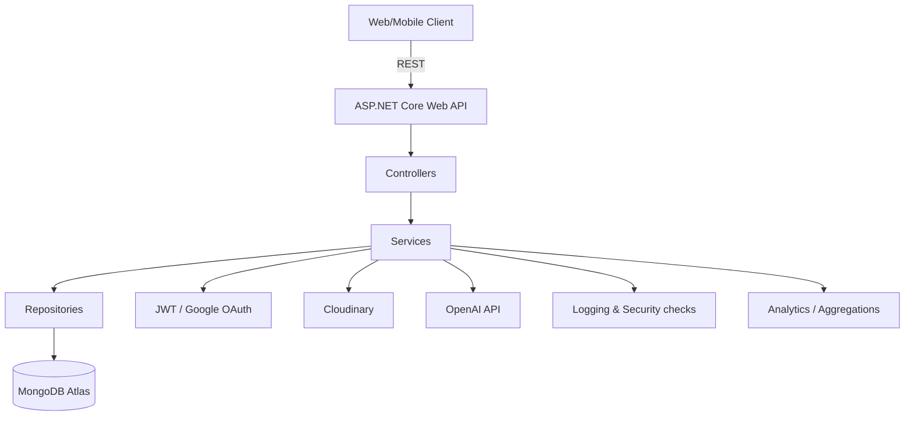

<div align="center">

# Naviria  
### Gamified Productivity Platform — Backend API

**Backend for a gamified system to manage tasks, goals & habits — with analytics, social features, and an AI assistant.**  
Built with **ASP.NET Core (.NET 8)** + **MongoDB Atlas**, focused on clean architecture, extensibility and real integrations.

<br/>

<!-- Badges -->


<br/>

<a href="#-highlights">Highlights</a> •
<a href="#-features">Features</a> •
<a href="#-architecture">Architecture</a> •
<a href="#-tech-stack">Tech Stack</a> •
<a href="#-getting-started">Getting Started</a> •
<a href="#-api">API</a> •
<a href="#-screenshots">Screenshots</a>

</div>

---

## ✨ Highlights

- **Extensible domain model:** polymorphic **tasks/subtasks** (standard / repeatable / scale / composite) with safe serialization.
- **Gamification engine:** XP, levels, achievements (Strategy pattern), rewards & notifications.
- **Analytics & leaderboards:** aggregation queries (personal/friends/global), chart datasets.
- **Real integrations:** Google OAuth, Cloudinary uploads, OpenAI assistant (chat + task generation).
- **Production-minded:** validation, security checks, export/import backups, Swagger + Postman workflow.

---

## 🎯 Features

### ✅ Tasks & Goals
- Tasks, folders, categories, tags
- Multiple task types:
  - **Standard** task
  - **Repeatable** task (check-ins)
  - **Scale** task (progress counters)
  - **Composite** task with subtasks

### 🧩 Polymorphic Subtasks
- Subtasks stored as **embedded documents** in MongoDB
- Heterogeneous collections via **discriminators** (custom JSON/BSON serialization)

### 🎮 Gamification
- XP + non-linear level progression
- Rewards calculation based on complexity (priority, deadlines, tags, subtasks, check-ins)
- Achievements subsystem using **Strategy pattern**
- Notifications for level-ups, achievements, deadlines & social “support”

### 📊 Analytics & Leaderboards
- Category breakdown datasets (pie charts)
- Monthly completion trends (time series)
- Repeatable check-in stats
- Leaderboards by level, points, completion %, achievements

### 🤝 Social
- User search & filtering
- Friend requests workflow
- “Support” feature: motivational messages/quotes to friends

### 🤖 AI Assistant
- Chat endpoint with context limits
- Task generation from natural language prompt (JSON → Create Task flow)

### 🔐 Security
- JWT auth + Google OAuth login
- Password hashing
- DTO + business validation services
- Suspicious message detection (regex/keywords) + logging
- Centralized error handling

### 💾 Backups
- Export/import DB data (archives)
- Scheduled weekly backups

---

## 🧱 Architecture

Naviria backend follows a modular layered approach:

- **Controllers** — HTTP endpoints (REST)
- **Services** — business logic (rules, gamification, analytics, notifications)
- **Repositories** — MongoDB data access
- **DTOs + Mapping** — stable API contracts



---

## 🛠 Tech Stack

**Backend**
- C# / .NET 8 / ASP.NET Core Web API
- Swagger / OpenAPI

**Data**
- MongoDB Atlas + MongoDB .NET Driver

**Auth & Integrations**
- JWT Authentication
- Google OAuth 2.0
- Cloudinary (media storage)
- OpenAI API (assistant)

**Tools**
- Git, Postman

## 🚀 Getting Started

### ✅ Prerequisites
- .NET SDK 8+
- MongoDB Atlas connection string (or local MongoDB)
- (Optional) Cloudinary account
- (Optional) Google OAuth credentials
- (Optional) OpenAI API key

### 🔑 Configuration
Create `appsettings.Development.json` (recommended) or use environment variables.

#### `appsettings.Development.json`
```json
{
  "MongoDb": {
    "ConnectionString": "YOUR_MONGODB_CONNECTION_STRING",
    "DatabaseName": "Naviria"
  },
  "Jwt": {
    "Issuer": "Naviria",
    "Audience": "Naviria",
    "Key": "YOUR_SUPER_SECRET_KEY"
  },
  "Authentication": {
    "Google": {
      "WebClientId": "YOUR_GOOGLE_CLIENT_ID"
    }
  },
  "Cloudinary": {
    "CloudName": "YOUR_CLOUD_NAME",
    "ApiKey": "YOUR_API_KEY",
    "ApiSecret": "YOUR_API_SECRET"
  },
  "OpenAI": {
    "ApiKey": "YOUR_OPENAI_API_KEY"
  }
}

```

---

## 🔎 API

> Exact endpoint names may vary depending on implementation — Swagger is the source of truth.

### Typical flows
- Auth → login / register / OAuth
- Tasks → create + update + complete + check-ins
- Subtasks → create + update + check-in
- Analytics → charts + leaderboards
- Backups → export/import

### Example payloads

#### Create task with polymorphic subtasks
```json
{
  "title": "Learn C#",
  "taskType": "with_subtasks",
  "subtasks": [
    { "subtaskType": "standard", "title": "Read docs", "isDone": false },
    { "subtaskType": "repeatable", "title": "Daily practice", "daysOfWeek": [1,3,5] },
    { "subtaskType": "scale", "title": "Solve problems", "currentValue": 3, "targetValue": 30, "unit": "tasks" }
  ]
}
```

---

## 🖼 Screenshots
<div align="center">
  
### 🖥 Web demo

</div>

<p align="center">
  <a href="Screenshots/web/login-web.png"></a> 
  <a href="Screenshots/web/registration-web.png"></a>
</p>

<p align="center">
  <a href="Screenshots/web/user-profile.png"></a> 
  <a href="Screenshots/web/community-web.png"></a>
</p>

<p align="center">
  <a href="Screenshots/web/task-example-web.png"></a> 
  <a href="Screenshots/web/task-creating-example-web.png"></a>
</p>

<p align="center">
  <a href="Screenshots/web/analytics-web.png"></a> 
  <a href="Screenshots/web/analytics-web-2.png"></a>
</p>

<div align="center">
  
### 📱 Mobile demo

</div>

<p align="center">
  <a href="Screenshots/mobile/login-mobile.png"></a> 
  <a href=Screenshots/mobile/user-profile-mobile.png"></a> 
  <a href="Screenshots/mobile/analytics-mobile.png"></a> 
  <a href="Screenshots/mobile/ai-task-mobile.png"></a>
</p>

<p align="center">
  <a href="Screenshots/mobile/task-creating-mobile.png"></a> 
  <a href="Screenshots/mobile/task-repetition-mobile.png"></a> 
  <a href="Screenshots/mobile/notifications-mobile.png"></a> 
  <a href="Screenshots/mobile/subtask-type-mobile.png"></a>
</p>
